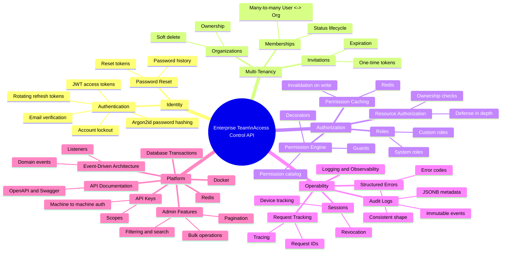
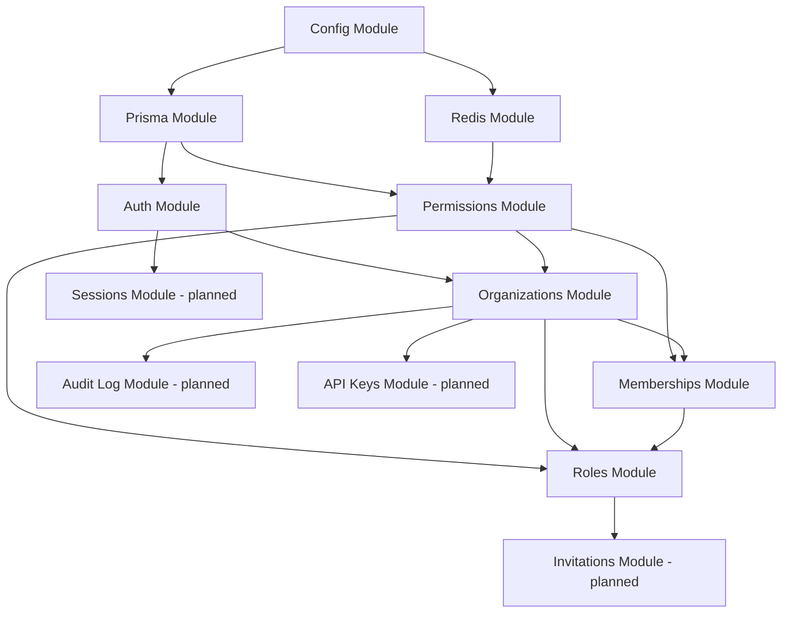
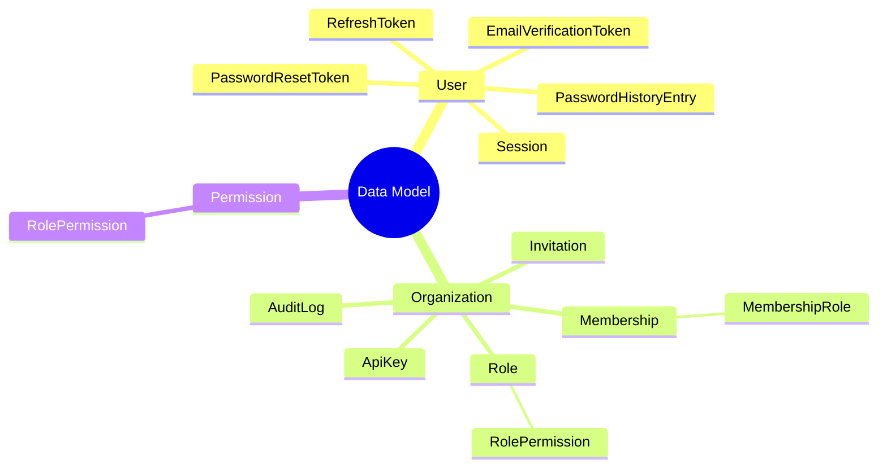

# Architecture Mind Map

> These diagrams show the **target design for the whole project**. Check
> [`ROADMAP.md`](./ROADMAP.md) on your current branch to see which parts
> already exist in code.

A birds-eye view of the whole project, meant to be skimmed before you go deep
into any one phase. Pair this with [`SYSTEM_DESIGN.md`](./SYSTEM_DESIGN.md)
(the "why") and [`PROJECT_STRUCTURE.md`](./PROJECT_STRUCTURE.md) (the "where").

## 1. Whole-project mind map

## 2. Module dependency mind map (what depends on what)

Read this bottom-up: `PermissionsModule` cannot exist without `PrismaModule`
and `RedisModule`; every feature module that enforces authorization
(`Organizations`, `Memberships`, `Roles`) depends on `PermissionsModule` for
its guard/service, not the other way around.

## 3. Data model mind map

See [`DATABASE.md`](./DATABASE.md) for the full entity-relationship
explanation, including why certain fields are nullable and why some
constraints are enforced in application code rather than the database.

## 4. How to use these diagrams while learning

1. Start at the **whole-project mind map** to see where a phase fits in the
   larger picture.
2. Open [`ROADMAP.md`](./ROADMAP.md) to see whether that phase is built yet
   and which files implement it.
3. Read the file-level doc comment at the top of each relevant file — every
   file in `src/` has one explaining its purpose, design rationale, and which
   phase it belongs to.
4. Cross-reference the sequence diagram in `SYSTEM_DESIGN.md` §3 to see where
   in the request lifecycle that file's code actually runs.
