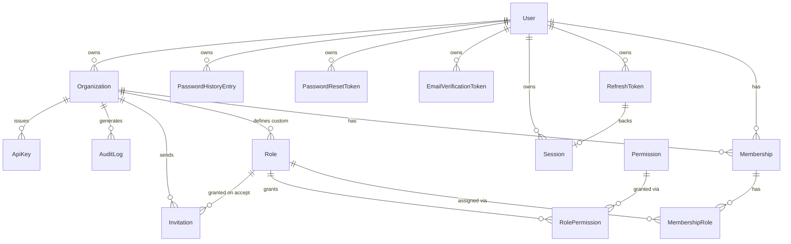

# Database Design

> This document describes the **full schema for all 22 phases**, designed up
> front (see [`ROADMAP.md`](./ROADMAP.md) for why). Every table below exists
> in the database on every branch; check `ROADMAP.md` on your current branch
> to see which tables already have application code reading/writing them.

Source of truth: [`prisma/schema.prisma`](../prisma/schema.prisma). This
document explains the *why* behind the schema; read the schema file itself
for the exact field list (it's heavily commented, phase by phase).

## Entity-relationship diagram



## Why each table exists

| Table                    | Phase | Purpose                                                                 |
|---------------------------|-------|--------------------------------------------------------------------------|
| `User`                    | 1     | A person who can authenticate. Global — not org-scoped.                 |
| `RefreshToken`            | 1     | Rotated, hashed, long-lived credential used to mint new access tokens.  |
| `EmailVerificationToken`  | 1     | One-time hashed token proving control of an email address.              |
| `PasswordResetToken`      | 13    | One-time hashed token authorizing a password change.                    |
| `PasswordHistoryEntry`    | 13    | Prevents reusing recent passwords.                                      |
| `Organization`            | 2     | A tenant. All business data is scoped underneath one of these.          |
| `Membership`              | 3     | Join of User <-> Organization, with a lifecycle status.                 |
| `Role`                    | 4     | A named bundle of permissions; system-wide or organization-specific.    |
| `Permission`              | 5     | The fixed catalog of fine-grained capabilities the system understands.  |
| `RolePermission`          | 4/5   | Join: which permissions a role grants.                                  |
| `MembershipRole`          | 4/5   | Join: which roles a membership holds (a member can hold >1 role).       |
| `Invitation`              | 8     | Pending offer for an email address to join an org with a given role.    |
| `Session`                 | 9     | User-visible "device", one per refresh-token rotation family.           |
| `AuditLog`                | 10    | Immutable, append-only record of security/business-relevant events.     |
| `ApiKey`                  | 12    | Machine-to-machine credential scoped to an organization with scopes.    |

## Design decisions worth understanding

### 1. Users are global; permissions are always organization-scoped
There is no `user.role` column anywhere. A user's capabilities are entirely
a function of *which organization* you ask about — resolved through
`Membership -> MembershipRole -> Role -> RolePermission -> Permission`. This
is what makes true multi-tenancy possible: the same person can be an OWNER of
one organization and have no access at all to another.

### 2. Tokens are stored hashed, never raw
`RefreshToken.tokenHash`, `EmailVerificationToken.tokenHash`,
`PasswordResetToken.tokenHash`, and (later) `Invitation.tokenHash` /
`ApiKey.keyHash` all store a SHA-256 hash, never the raw secret. If the
database ever leaked, none of these hashes could be replayed directly against
the API — an attacker would need to reverse a cryptographic hash, which is
computationally infeasible.

### 3. Refresh tokens have a `family`
Every time a refresh token is used, it's revoked and a new one is created
with the **same `family`** value. If a revoked token is ever presented again,
that's a signal of token theft (a copy was made and is being replayed), so
the whole family is revoked — see `AuthService.refresh()` and
`SYSTEM_DESIGN.md` §5.

### 4. Soft delete on `Organization`
`Organization.deletedAt` is nullable; "deleting" an org sets this timestamp
rather than removing the row. This preserves audit history and referential
integrity for anything that still points at the org (audit logs, in
particular, should never silently lose their organization context). All
normal queries filter `deletedAt: null`.

### 5. System roles use `organizationId: null`
`OWNER`, `ADMIN`, and `MEMBER` are seeded once (`prisma/seed.ts`) with
`organizationId = null`, making them available to every tenant without
duplicating rows per organization. Organizations can additionally create
their own custom `Role` rows scoped to just themselves.

> **Postgres gotcha documented in code:** a compound unique constraint like
> `@@unique([organizationId, name])` does **not** prevent duplicate rows when
> `organizationId` is `NULL`, because SQL treats every `NULL` as distinct from
> every other `NULL` in a unique index. `prisma/seed.ts` works around this by
> looking up system roles with `findFirst` instead of relying on `upsert`'s
> compound-unique matching.

### 6. Why Prisma is pinned to v6, not v7
Prisma 7 removed the traditional `datasource { url = env(...) }` pattern in
favor of driver adapters configured in a separate `prisma.config.ts`. For a
learning project, the v6 approach is simpler, matches the vast majority of
existing tutorials/documentation, and avoids adding a driver-adapter package
just to get a connection string working.

## Running database commands

```bash
npm run docker:up        # start Postgres + Redis
npm run prisma:migrate   # create/apply a migration from schema changes
npm run prisma:generate  # regenerate the Prisma client after schema edits
npm run prisma:seed      # (re)seed system roles + permission catalog
npm run prisma:studio    # open Prisma Studio (visual DB browser)
```
