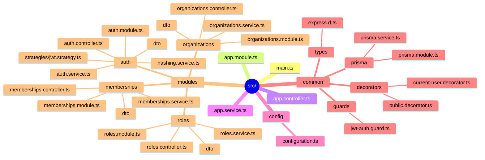

# Project Structure — File-by-File Guide (Phase 4)

This document is accurate to **this branch only** (`phase-4`) — it lists the
files that actually exist right now. Each phase branch updates this file to
add the new files introduced by that phase. For the eventual full structure,
see [`ARCHITECTURE_MINDMAP.md`](./ARCHITECTURE_MINDMAP.md) (target design).

## Directory-by-directory explanation

### `src/main.ts`
Application bootstrap: security headers (`helmet`), CORS, global
`ValidationPipe`, and the global API prefix (`/api/v1`).

### `src/app.module.ts`
The composition root. On this branch: `ConfigModule`, `ThrottlerModule`,
`PrismaModule`, and `AuthModule`, with two global guards running on every
request: `JwtAuthGuard` → `ThrottlerGuard`.

### `src/config/configuration.ts`
One typed object describing every environment-driven setting the app uses.
Everything reads config through `ConfigService.get(...)` instead of touching
`process.env` directly.

### `src/common/prisma/`
- `prisma.service.ts` — injectable wrapper around `PrismaClient` with
  connect/disconnect lifecycle hooks.
- `prisma.module.ts` — makes `PrismaService` available everywhere via
  `@Global()`.

### `src/common/guards/jwt-auth.guard.ts`
Validates the access token on every request unless the route is
`@Public()`. "Secure by default."

### `src/common/decorators/`
- `public.decorator.ts` — opts a route out of the global `JwtAuthGuard`.
- `current-user.decorator.ts` — pulls the authenticated user (`sub`, `email`)
  off `request.user`.

### `src/common/types/express.d.ts`
Augments Express's `Request.user` type (via `Express.User`) so
`request.user` is properly typed everywhere, instead of `any`.

### `src/modules/auth/` — Phase 1 (Authentication)
- `auth.module.ts` — wires Passport + JWT signing + the controller/service.
- `auth.controller.ts` — `/auth/register`, `/login`, `/refresh`, `/logout`,
  `/verify-email`. All `@Public()`.
- `auth.service.ts` — registration, credential checks, account lockout,
  refresh token rotation + theft detection, email verification.
- `hashing.service.ts` — Argon2id for passwords, SHA-256 for opaque tokens.
- `strategies/jwt.strategy.ts` — Passport strategy that verifies the access
  token's signature/expiry and populates `request.user`.
- `dto/` — `class-validator`-annotated request bodies for each endpoint.

### `src/modules/organizations/` — Phase 2 (Organizations)
- `organizations.service.ts` — create/list/read/update/soft-delete, with
  ownership checks inline (see the file's header comment for why this is
  intentionally simple at this phase, and how it evolves in Phase 5).
- `organizations.controller.ts` — routes, all behind the global
  `JwtAuthGuard`.
- `dto/` — `class-validator`-annotated request bodies.

### `src/modules/memberships/` — Phase 3 (Memberships)
- `memberships.service.ts` — list/add/suspend/remove members; every method
  reuses `OrganizationsService.assertOwner(...)` for its authorization check.
- `memberships.controller.ts` — nested under `/organizations/:organizationId/members`.
- `dto/` — `AddMemberDto` (add an existing user by email), `UpdateMembershipDto`.

### `src/modules/roles/` — Phase 4 (Roles)
- `roles.service.ts` — list system + custom roles, create/update/delete
  custom roles, assign/unassign a role on a membership. Ownership-authorized
  for now (see the file's header comment).
- `roles.controller.ts` — nested under `/organizations/:organizationId`.
- `dto/` — `CreateRoleDto`, `UpdateRoleDto`.

### `prisma/seed.ts`
Seeds the permission catalog and the three built-in system roles (OWNER,
ADMIN, MEMBER). Run with `npm run prisma:seed`.

### `prisma/schema.prisma`
The full data model for all 22 phases (see [`DATABASE.md`](./DATABASE.md)) —
`User`, `RefreshToken`, `EmailVerificationToken`, `Organization`,
`Membership`, `Role`, `Permission`, `RolePermission`, and `MembershipRole`
are all used by application code on this branch.

---

For the *why* behind these files' relationships, see
[`SYSTEM_DESIGN.md`](./SYSTEM_DESIGN.md). For what's next, see
[`ROADMAP.md`](./ROADMAP.md).
