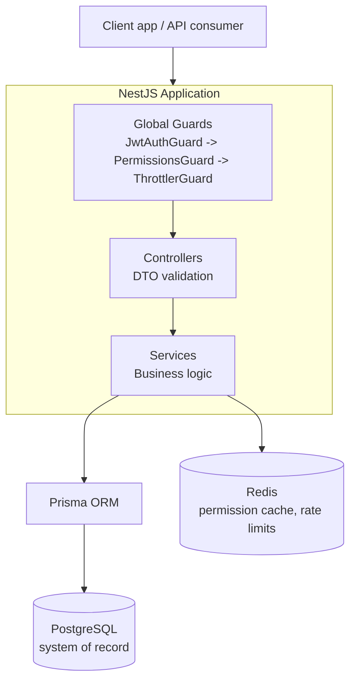
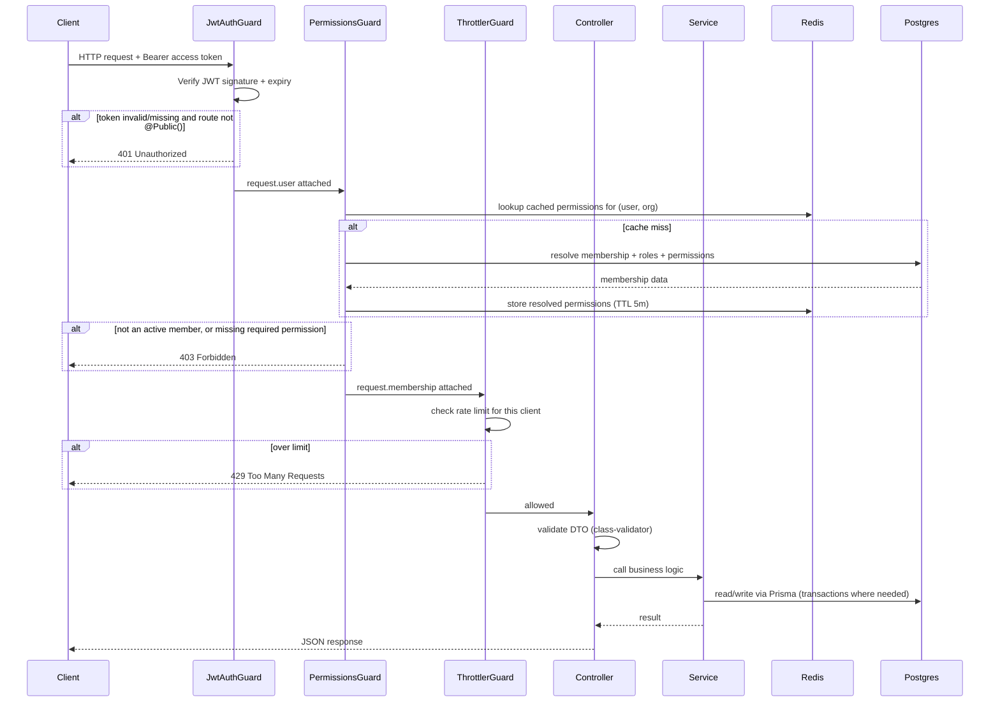
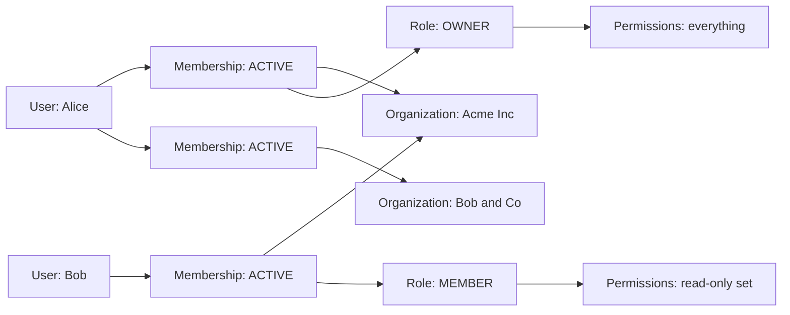
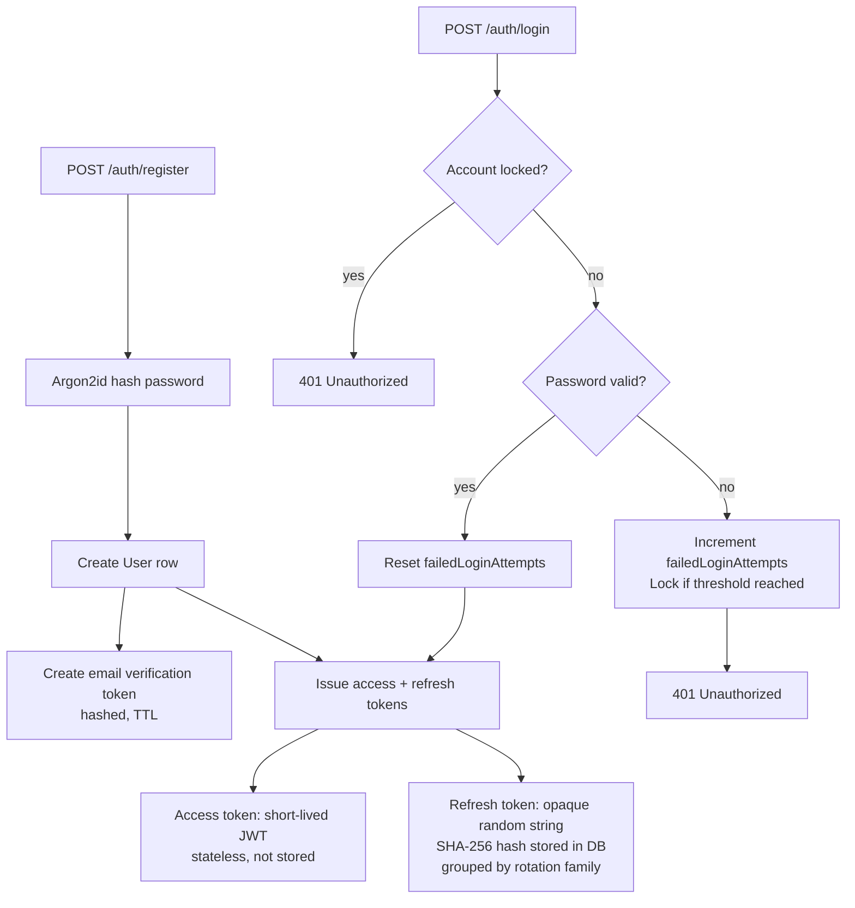
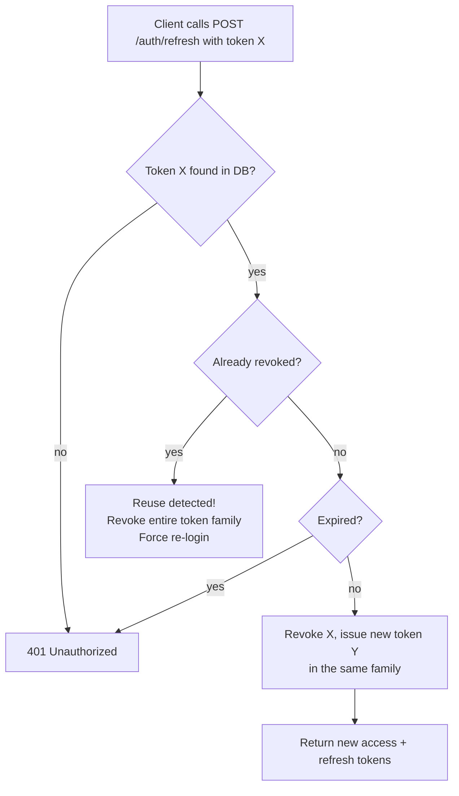
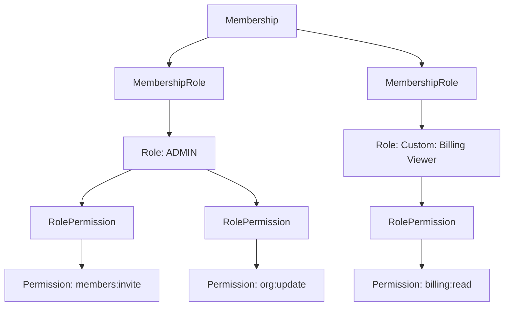

# System Design — Enterprise Team Access Control API

This document explains **how the system is put together** and **why**, independent
of any single file. Read this before diving into the code; read
[`PROJECT_STRUCTURE.md`](./PROJECT_STRUCTURE.md) once you're ready to map these
concepts onto actual files.

---

## 1. What this system is

A multi-tenant backend where:

- Many independent **organizations** (tenants) share one deployment.
- Each **user** can belong to multiple organizations, with different roles in each.
- Access to every resource is mediated by a **permission engine** built on roles,
  not hardcoded role-name checks.
- Every security-sensitive action is **traceable** (audit logs, request IDs).

---

## 2. High-level architecture

**Why this layering?**

- **Guards** run before any controller code, enforcing "secure by default":
  every route requires a valid access token and, where scoped to an
  organization, active membership + permissions — unless explicitly opted out.
- **Controllers** only validate input shape (DTOs) and delegate to services.
  They contain no business logic.
- **Services** own business rules and talk to Prisma/Redis. This keeps
  authorization/business logic testable without an HTTP layer.
- **Redis** sits beside Postgres as a fast, short-lived cache — never the
  system of record.

---

## 3. Request lifecycle (a protected, organization-scoped request)

This single diagram encodes most of Phases 1, 5, 6, 7, and 11.

---

## 4. Multi-tenancy model

Key rule: **a User is global, but every permission check is scoped to one
Organization via that user's Membership in it.** There is no such thing as a
permission that applies "everywhere" — even the OWNER role's permissions only
apply within the organization the membership belongs to.

---

## 5. Authentication design (Phase 1)

**Refresh token rotation & theft detection:**

If a refresh token is ever replayed after it was already rotated away, that's
strong evidence someone else has a copy of it — so the whole chain is
invalidated rather than trusting that specific token again.

---

## 6. The permission engine (Phases 4 & 5)

A membership's **effective permission set** is the union of every permission
granted by every role attached to it. Adding a new capability to the system
means adding a `Permission` row and attaching it to relevant `Role`s — no
guard or controller code changes.

**Why not `if (user.role === 'admin')`?**
That pattern hardcodes business rules into code, can't express "two roles",
can't support per-organization custom roles, and requires a deploy to change
what a role can do. The permission engine makes all of this data-driven.

---

## 7. Caching strategy (Phase 6)

- Cache key: `permissions:<userId>:<organizationId>`
- Value: resolved membership status + permission key list
- TTL: 5 minutes (bounds staleness even if an invalidation is ever missed)
- **Explicit invalidation** on every mutation that could change the result:
  - Membership status changes (suspend/reactivate/remove)
  - Role assignment/unassignment on a membership
  - A role's permission set changes (invalidates everyone holding that role)

This is a classic **read-heavy, write-light** cache: permission checks happen
on nearly every request, but roles/memberships change rarely — a perfect fit
for caching with invalidation-on-write rather than a fixed short TTL alone.

---

## 8. Defense in depth (Phase 7)

Three independent layers must all agree before a request touches data:

1. **JwtAuthGuard** — is this a genuine, non-expired access token?
2. **PermissionsGuard** — is this user an ACTIVE member of the organization
   in the URL, and do they hold the required permission?
3. **Service-layer scoping** — every Prisma query is filtered by
   `organizationId` (and `deletedAt: null` for soft-deleted rows), so even a
   bug in the guard layer wouldn't leak cross-tenant data.

No single layer is trusted alone — this is what "defense in depth" means in
practice.

---

## 9. Database transactions (Phase 18)

Any workflow with more than one write that must succeed or fail together uses
`prisma.$transaction(...)`. Concrete examples already implemented:

- **Create organization**: Organization row + owner Membership row +
  MembershipRole(OWNER) row — three writes, one unit.
- **Refresh token rotation**: revoke old token + create new token + update the
  Session pointer — must stay consistent or a user could get logged out or
  end up with two "current" tokens for one session.
- **Email verification**: consume the token + mark the user verified.

---

## 10. Security posture (Phase 11) baked in from day one

| Concern                  | Mechanism                                                        |
|---------------------------|-------------------------------------------------------------------|
| Transport/header hygiene  | `helmet()` in `main.ts`                                          |
| Input validation          | Global `ValidationPipe` (`whitelist`, `forbidNonWhitelisted`)     |
| Rate limiting              | `@nestjs/throttler` global guard                                  |
| Secrets                    | `.env` (git-ignored), never hardcoded, loaded via `ConfigService` |
| Password storage           | Argon2id (memory-hard, tunable cost)                              |
| Token storage               | Only hashes stored for refresh/verification/reset tokens         |
| Account brute-forcing      | Progressive lockout after N failed attempts                      |
| Cross-tenant access        | PermissionsGuard + service-layer scoping (defense in depth)      |

---

## 11. What's implemented vs. planned

This document describes the **target architecture for the whole project**.
Any given git branch (`phase-1`, `phase-2`, ...) implements only a prefix of
it. See [`ROADMAP.md`](./ROADMAP.md) on the branch you're viewing for exactly
what's built so far and what the next branch adds. The database schema
(`prisma/schema.prisma`) already models every phase (sessions, audit logs,
invitations, API keys, password reset) so later modules are built directly on
top of the existing data without migration churn.
